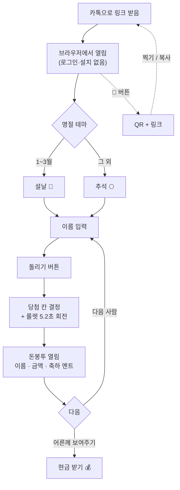
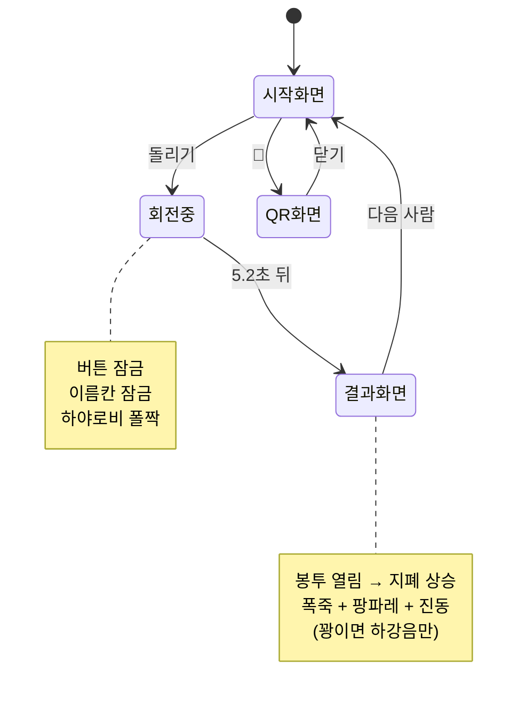
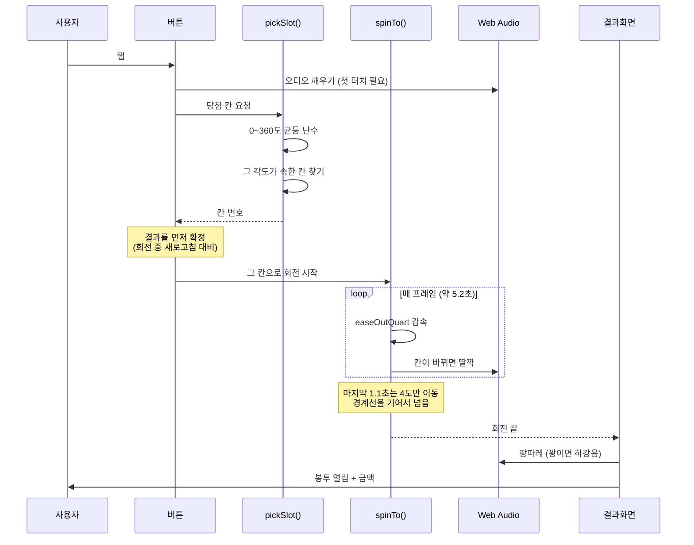
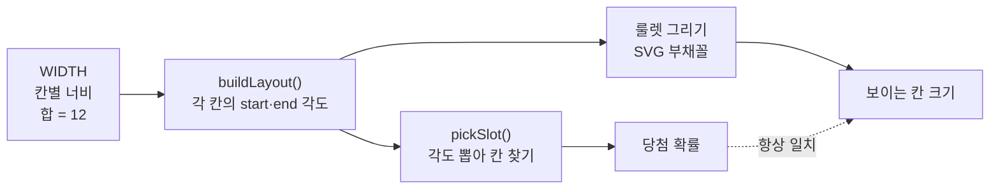
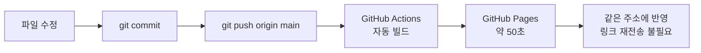
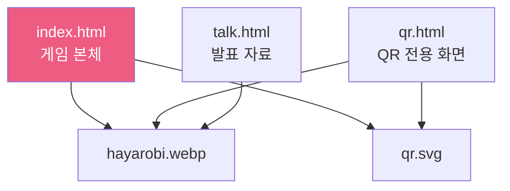

# 흐름도

GitHub에서 이 문서를 열면 아래 도형들이 그림으로 보입니다.

---

## 1. 사용자 흐름

링크를 받은 사람이 겪는 전체 과정.



> 점선은 게임이 퍼져나가는 경로입니다. 옆 사람은 QR을 찍고, 멀리 있는 사람에겐 링크를 복사해 보냅니다.

---

## 2. 화면 상태

화면은 세 가지 상태만 오갑니다.



---

## 3. 돌리기 한 번의 내부 순서

버튼을 누른 뒤 5.2초 동안 코드 안에서 벌어지는 일.



---

## 4. 당첨 칸을 고르는 방법

가중치 표 없이 확률을 칸 넓이에 맞추는 구조.



> 그리는 쪽과 뽑는 쪽이 **같은 `layout` 배열**을 씁니다. 그래서 `WIDTH` 한 곳만 고치면 그림과 확률이 함께 움직이고, 둘이 어긋날 수가 없습니다.

---

## 5. 배포 흐름



```bash
cd "C:/Users/note/Desktop/구미코딩모임/룰렛" && git add -A && git commit -m "수정" && git push
```

---

## 6. 파일 관계



`index.html` 안에 HTML · CSS · JavaScript가 모두 들어 있습니다. 빌드 과정이 없어서 파일을 브라우저로 바로 열면 그대로 동작합니다.

---

**AI커뮤니티랩 하야로비** · AI 인재와 지역을 연결하는 AI 협업 플랫폼
